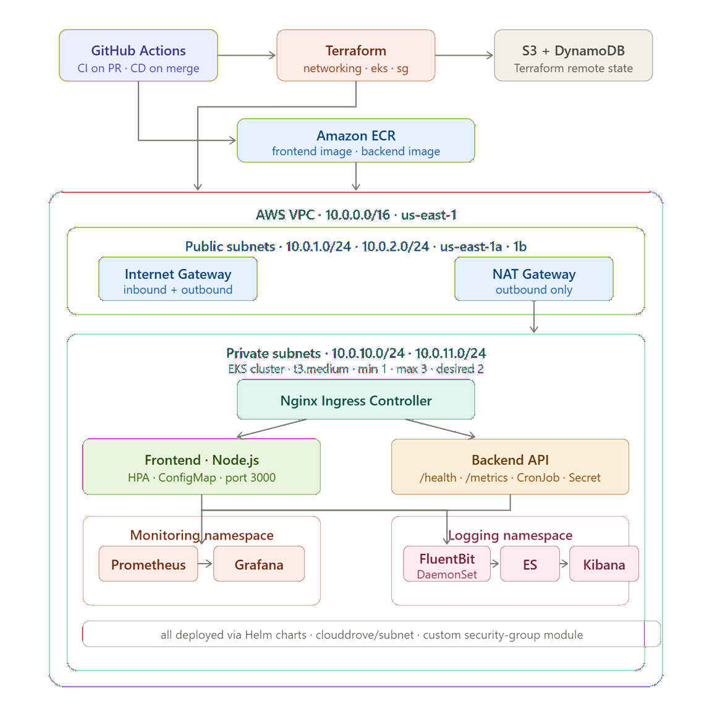
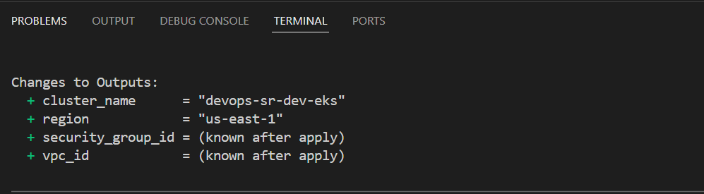
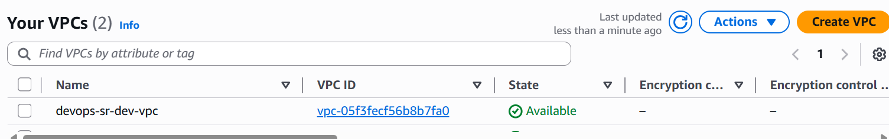

# DevOps Assessment — Saroj

## Project Overview

Production-ready DevOps implementation on AWS EKS using Terraform,
Docker, Kubernetes, GitHub Actions CI/CD, Grafana and Kibana.

| Category | Tools |
|---|---|
| Cloud | AWS (EKS, VPC, ECR, S3, DynamoDB) |
| Infrastructure | Terraform |
| Containers | Docker |
| Orchestration | Kubernetes + Helm |
| CI/CD | GitHub Actions |
| Monitoring | Prometheus + Grafana |
| Logging | FluentBit + Elasticsearch + Kibana |

---

## Architecture



---

## Repository Structure

```
devops-assessment-saroj/
├── terraform/
│   ├── modules/
│   │   ├── networking/
│   │   ├── eks/
│   │   └── security-group/
│   └── main.tf, variables.tf, outputs.tf ...
├── docker/
│   ├── frontend/
│   └── backend/
├── kubernetes/
│   ├── helm/
│   └── manifests/
├── .github/workflows/
├── scripts/
└── screenshots/
```

---

## Prerequisites

```bash
terraform >= 1.5.0
kubectl   >= 1.27
helm      >= 3.12
docker    >= 24.0
aws cli   >= 2.0
```

---

## Terraform Deployment

```bash
# create remote state backend first
aws s3api create-bucket \
  --bucket saroj-eks-tfstate-2026 \
  --region us-east-1

aws dynamodb create-table \
  --table-name terraform-state-lock \
  --attribute-definitions AttributeName=LockID,AttributeType=S \
  --key-schema AttributeName=LockID,KeyType=HASH \
  --billing-mode PAY_PER_REQUEST

# deploy infrastructure
cd terraform
terraform init
terraform validate
terraform plan
terraform apply
```

Screenshots:







---

## Kubernetes Deployment

```bash
# connect to cluster
aws eks update-kubeconfig \
  --name devops-assessment-saroj-dev-eks \
  --region us-east-1

# create namespace
kubectl create namespace app

# install nginx ingress
helm repo add ingress-nginx \
  https://kubernetes.github.io/ingress-nginx
helm upgrade --install ingress-nginx \
  ingress-nginx/ingress-nginx \
  --namespace ingress-nginx --create-namespace

# build and push docker images
./scripts/build-images.sh latest

# deploy frontend and backend
./scripts/deploy.sh latest

# install prometheus and grafana
helm repo add prometheus-community \
  https://prometheus-community.github.io/helm-charts
helm upgrade --install monitoring \
  prometheus-community/kube-prometheus-stack \
  --namespace monitoring --create-namespace \
  -f kubernetes/helm/observability/grafana-values.yaml

# install efk stack
helm repo add elastic https://helm.elastic.co
helm repo add fluent https://fluent.github.io/helm-charts
helm upgrade --install elasticsearch elastic/elasticsearch \
  --namespace logging --create-namespace
helm upgrade --install kibana elastic/kibana \
  --namespace logging
helm upgrade --install fluent-bit fluent/fluent-bit \
  --namespace logging

# verify everything running
kubectl get all -n app
kubectl get hpa -n app
kubectl get ingress -n app
```

Screenshots:


---

## CI/CD Pipeline

CI runs on every pull request to main:

```
terraform validate
docker build test
helm lint
upload artifacts
```

CD runs on every merge to main:

```
terraform plan and apply
docker build and push to ECR
helm deploy frontend and backend
rollout verification
smoke test /health and /metrics
```

Screenshots:


---

## Grafana Monitoring

```bash
kubectl port-forward svc/monitoring-grafana 3000:80 -n monitoring
# open http://localhost:3000
# username: admin
# password: admin123
```

Dashboards include pod CPU/memory, node exporter,
API latency and request count.


---

## Kibana Logging

```bash
kubectl port-forward svc/kibana-kibana 5601:5601 -n logging
# open http://localhost:5601
# create index pattern: logstash-*
```

Dashboard includes error count, status codes,
top endpoints and request rate.


---

## Issues Faced & Fixes

**Issue 1 — CloudDrove VPC v2.0.5 internal bug**

CloudDrove VPC module referenced `data.aws_region.current.region`
internally which does not exist, causing terraform validate to fail.
Fixed by switching to `terraform-aws-modules/vpc` for VPC creation
and keeping `clouddrove/subnet/aws` for subnets.

**Issue 2 — Wrong inputs passed to CloudDrove VPC module**

Initially passed `azs`, `public_subnets`, `private_subnets` and
`enable_nat_gateway` to the VPC module. These inputs do not exist
in v2.0.5. Fixed by moving all subnet inputs to the subnet module.

**Issue 3 — Windows Git Bash chmod not working**

Running `chmod +x scripts/*.sh` on Windows had no effect before
the first commit. Fixed using `git update-index --chmod=+x`.

---

## Improvements Roadmap

 # Improvement

 - ArgoCD - GitOps-based continuous delivery 
 - Vault - Proper secret management 
 - Multi-environment - dev, staging, prod workspaces 
 - Velero = Cluster backup and disaster recovery 
 - OPA Gatekeeper - Policy enforcement 
 - Karpenter Node autoscaling 

---

## Author

Saroj — CloudMa