# DevOps Assessment — Saroj Rani

## Project Overview

Production-ready DevOps implementation on AWS EKS using Terraform,
Docker, Kubernetes, GitHub Actions CI/CD, Grafana and Kibana.

| Category | Tools |
|---|---|
| Cloud | AWS (EKS, VPC, ECR, S3, DynamoDB) |
| Infrastructure | Terraform |
| Containers | Docker |
| Orchestration | Kubernetes + Helm |
| CI/CD | GitHub Actions |
| Monitoring | Prometheus + Grafana |
| Logging | FluentBit + Elasticsearch + Kibana |

---

## Architecture


---

## Repository Structure

```
devops-assessment-saroj/
├── terraform/
│   ├── modules/
│   │   ├── networking/        # custom VPC module
│   │   ├── eks/               # custom EKS module
│   │   └── security-group/    # custom SG module
│   ├── main.tf
│   ├── variables.tf
│   ├── outputs.tf
│   ├── backend.tf
│   └── versions.tf
├── docker/
│   ├── frontend/              # Node.js frontend app
│   └── backend/               # Node.js backend API
├── kubernetes/
│   ├── helm/
│   │   ├── frontend/          # frontend helm chart
│   │   ├── backend/           # backend helm chart
│   │   └── observability/     # grafana/prometheus values
│   └── manifests/             # raw kubernetes manifests
├── .github/
│   └── workflows/
│       ├── ci.yml             # CI pipeline (PR)
│       └── cd.yml             # CD pipeline (main)
├── scripts/
│   ├── build-images.sh
│   ├── deploy.sh
│   └── smoke-test.sh
├── docs/
│   └── troubleshooting/
│       └── infrastructure-issues-and-fixes.md
└── screenshots/
```

---

## Prerequisites

```bash
terraform >= 1.5.0
kubectl   >= 1.27
helm      >= 3.12
docker    >= 24.0
aws cli   >= 2.0
```

---

## Terraform Deployment

### Remote Backend Setup

```bash
# Create S3 bucket for state
aws s3api create-bucket \
  --bucket saroj-eks-tfstate-2026 \
  --region us-east-1

# Create DynamoDB table for state locking
aws dynamodb create-table \
  --table-name terraform-state-lock \
  --attribute-definitions AttributeName=LockID,AttributeType=S \
  --key-schema AttributeName=LockID,KeyType=HASH \
  --billing-mode PAY_PER_REQUEST
```

### Deploy Infrastructure

```bash
cd terraform
terraform init
terraform validate
terraform plan
terraform apply
```

### Infrastructure Created

- VPC with public and private subnets
- Internet Gateway + NAT Gateway
- Route tables (public → IGW, private → NAT)
- Security Groups
- NACL rules
- EKS cluster (v1.30) with managed node group
- Remote backend (S3 + DynamoDB)

### Screenshots

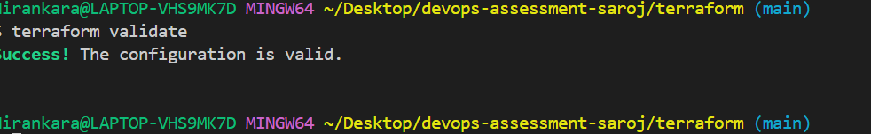

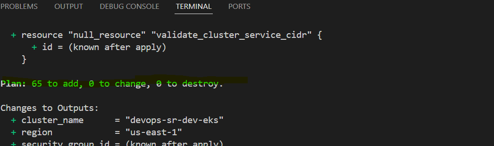

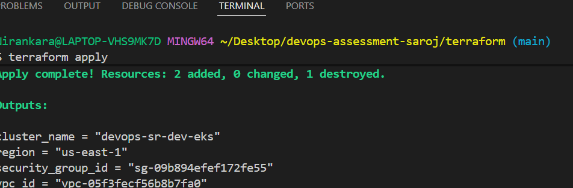


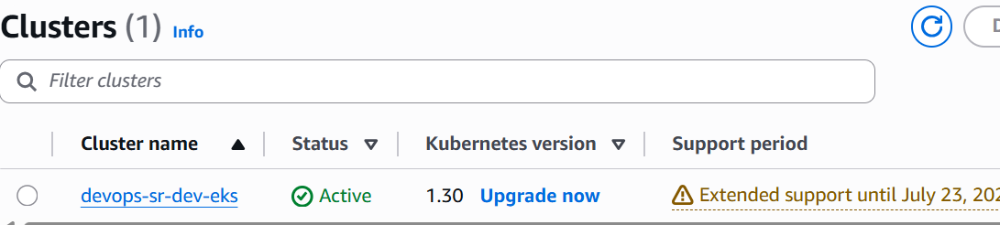

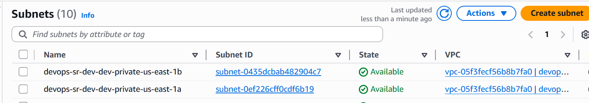

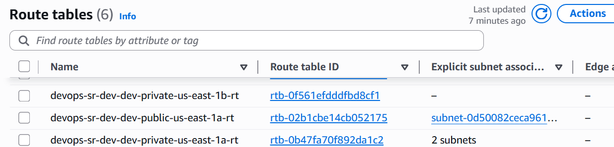

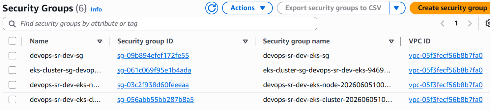

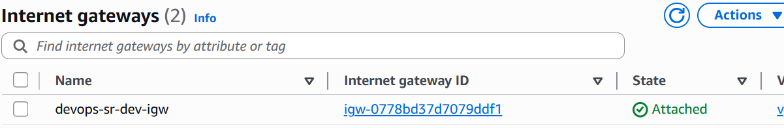

---

## Kubernetes Deployment

### Connect to Cluster

```bash
aws eks update-kubeconfig \
  --name devops-sr-dev-eks \
  --region us-east-1

kubectl get nodes
```

### Install Nginx Ingress Controller

```bash
helm repo add ingress-nginx https://kubernetes.github.io/ingress-nginx
helm repo update
helm upgrade --install ingress-nginx ingress-nginx/ingress-nginx \
  --namespace ingress-nginx --create-namespace \
  --set controller.replicaCount=1
```

### Build and Push Docker Images to ECR

```bash
# Login to ECR
aws ecr get-login-password --region us-east-1 | docker login \
  --username AWS \
  --password-stdin 464218211325.dkr.ecr.us-east-1.amazonaws.com

# Build and push
docker build -t 464218211325.dkr.ecr.us-east-1.amazonaws.com/frontend:latest ./docker/frontend
docker push 464218211325.dkr.ecr.us-east-1.amazonaws.com/frontend:latest

docker build -t 464218211325.dkr.ecr.us-east-1.amazonaws.com/backend:latest ./docker/backend
docker push 464218211325.dkr.ecr.us-east-1.amazonaws.com/backend:latest
```

### Deploy Frontend and Backend

```bash
helm upgrade --install frontend ./kubernetes/helm/frontend
helm upgrade --install backend ./kubernetes/helm/backend
```

### Verify Deployment

```bash
kubectl get pods
kubectl get svc
kubectl get hpa
kubectl get ingress
kubectl get cronjobs
```

### Screenshots

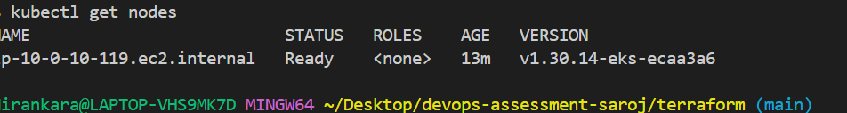

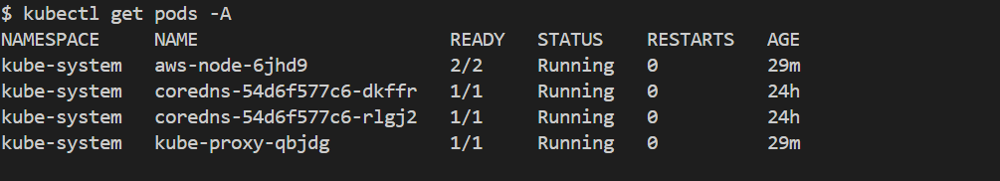

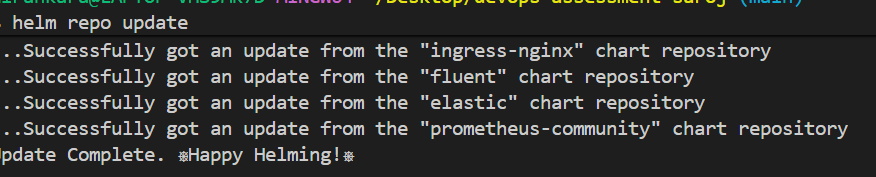

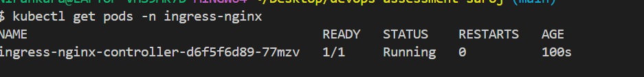

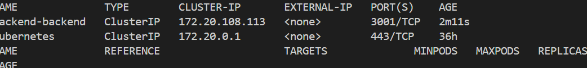

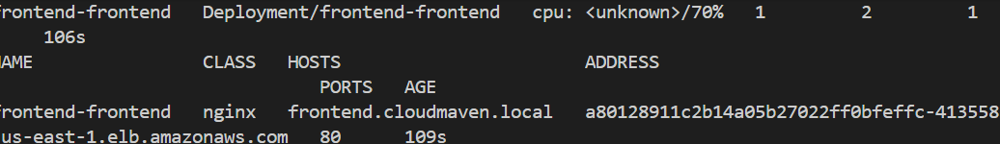

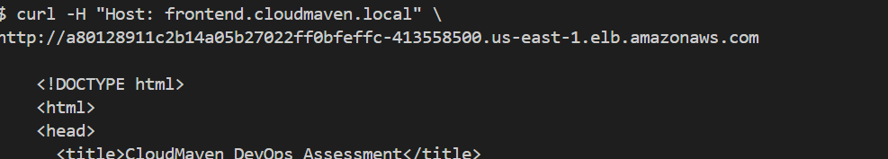

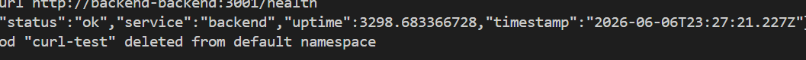

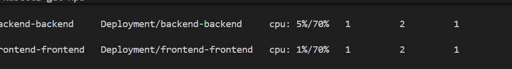

### Docker Screenshots

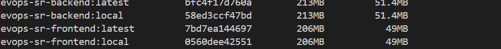

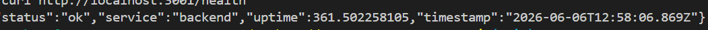

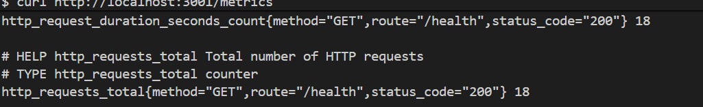

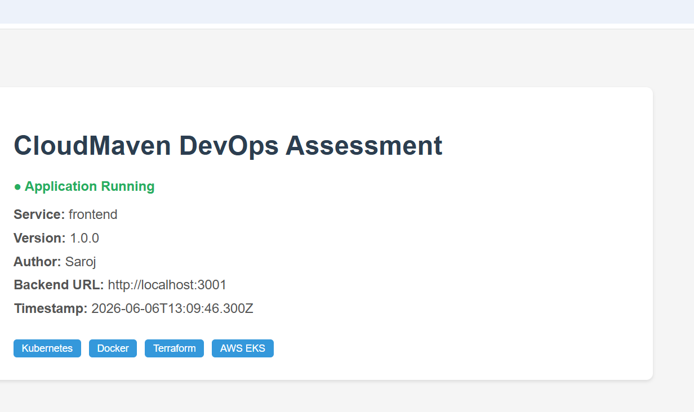

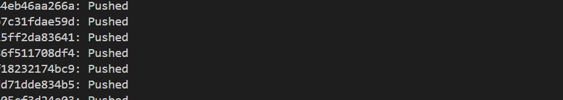


---

## CI/CD Pipeline

### CI Pipeline (Pull Request → main)

Triggers on every pull request to main branch.

| Job | What it does |
|-----|-------------|
| Terraform Validate | init + validate + fmt check |
| Docker Build Test | builds images + health checks |
| Kubernetes Lint | helm lint + dry-run manifests |
| Upload Artifacts | uploads terraform, k8s, docker files |

### CD Pipeline (Push → main)

Triggers on every merge/push to main branch.

| Job | What it does |
|-----|-------------|
| Terraform Plan & Apply | provisions infrastructure |
| Docker Build & Push | builds and pushes to ECR |
| Deploy to EKS | helm deploy frontend + backend |
| Rollout Verification | checks deployment status |
| Smoke Test | tests /health and /metrics endpoints |

### GitHub Secrets Required

```
AWS_ACCESS_KEY_ID
AWS_SECRET_ACCESS_KEY
```

---

## Grafana Monitoring

### Access Grafana

```bash
kubectl port-forward svc/kube-prometheus-stack-grafana \
  3000:80 -n monitoring

# open http://localhost:3000
# username: admin
# password: admin123
```

### Dashboards Available

- Kubernetes Compute Resources — Cluster
- Kubernetes Compute Resources — Node
- Kubernetes Compute Resources — Pod
- Node Exporter — Full

### Screenshots

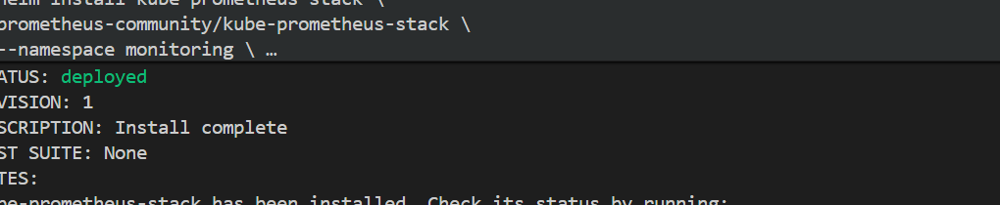

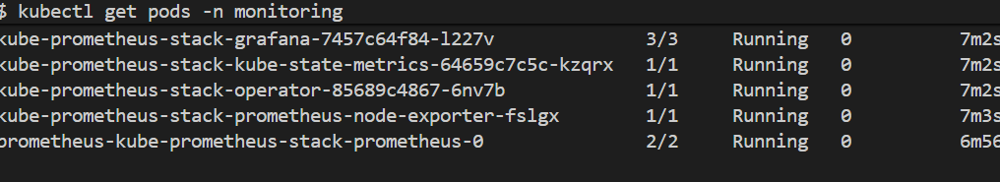

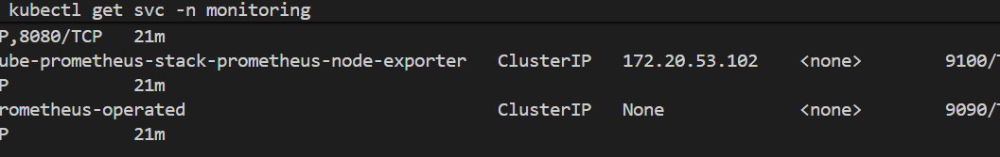

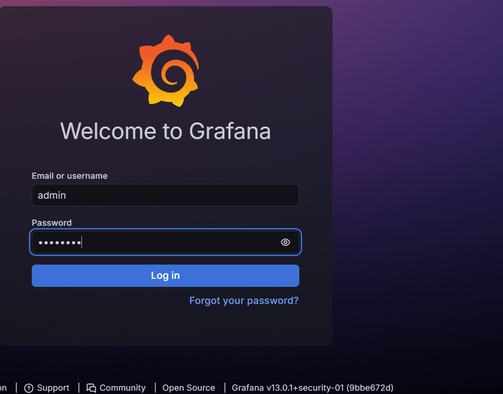

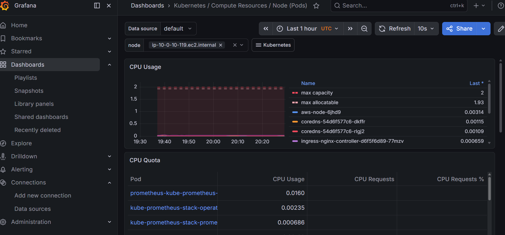

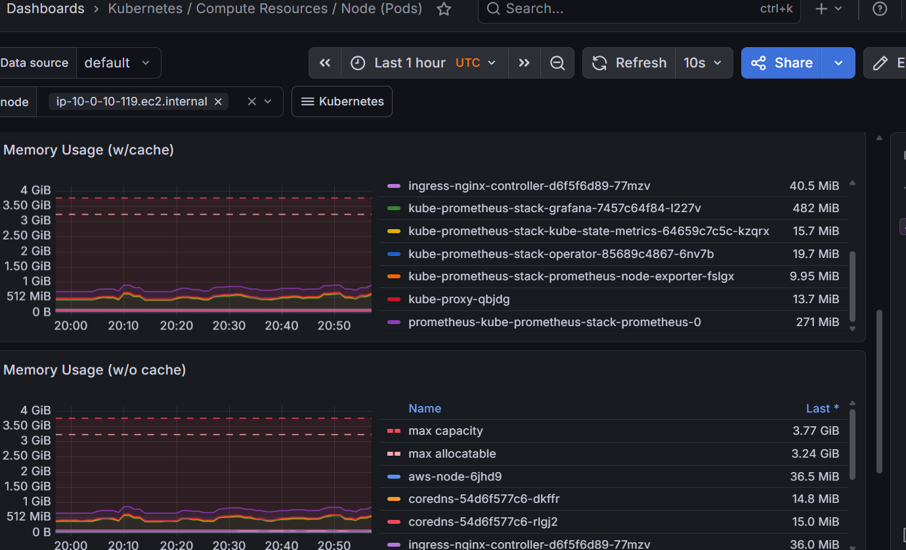

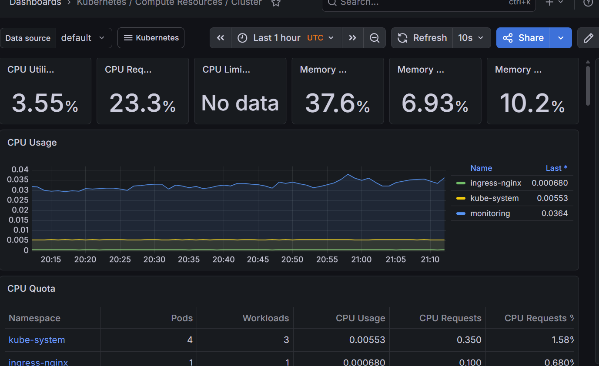

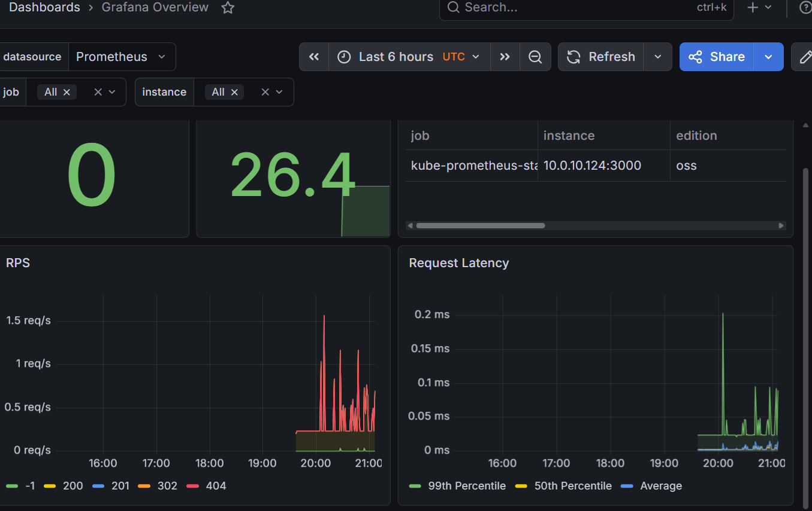

---

## Kibana Logging

### Install EFK Stack

```bash
# Elasticsearch
helm install elasticsearch elastic/elasticsearch \
  --namespace logging --create-namespace \
  --set replicas=1 \
  --set minimumMasterNodes=1 \
  --set persistence.enabled=false

# Kibana
helm install kibana elastic/kibana \
  --namespace logging

# FluentBit
helm install fluent-bit fluent/fluent-bit \
  --namespace logging
```

### Access Kibana

```bash
kubectl port-forward svc/kibana-kibana 5601:5601 -n logging
# open http://localhost:5601
# username: elastic
# password: (get from secret)

kubectl get secret elasticsearch-master-credentials \
  -n logging \
  -o jsonpath="{.data.password}" | base64 --decode
```

### Setup Index Pattern

```
Stack Management → Index Patterns → Create
Name: logstash-*
Timestamp: @timestamp
```

### Screenshots

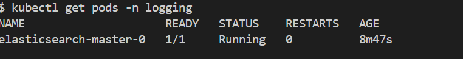

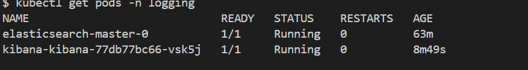

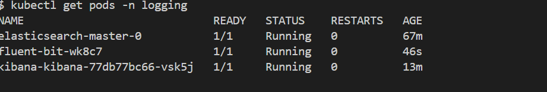

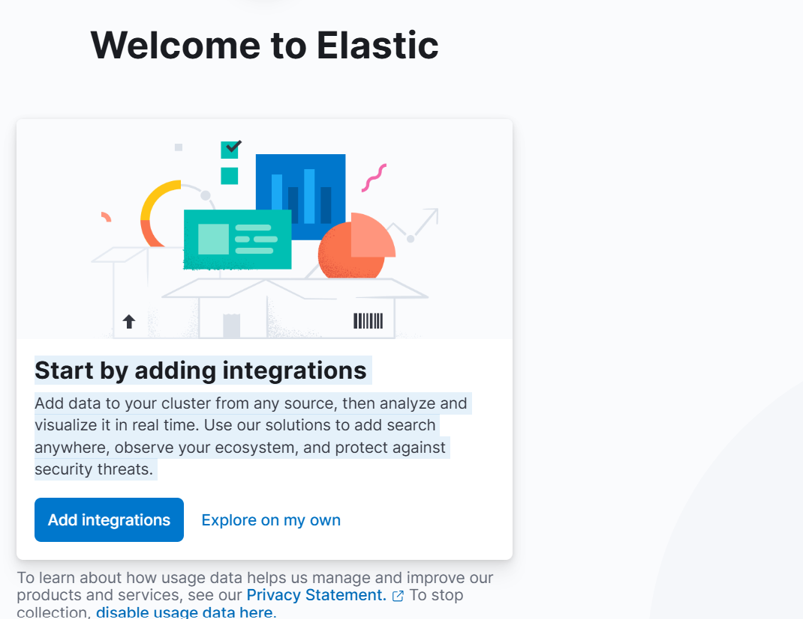

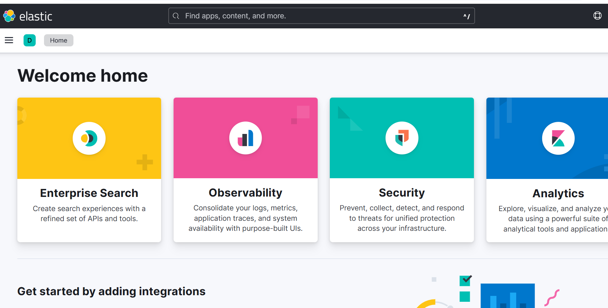

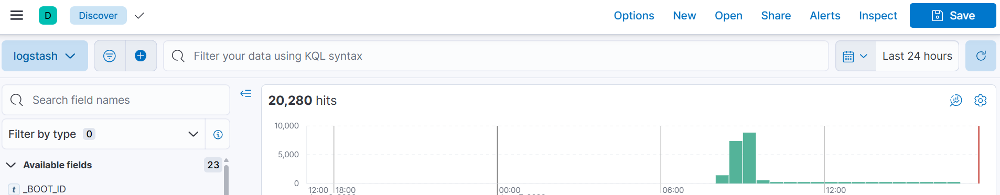

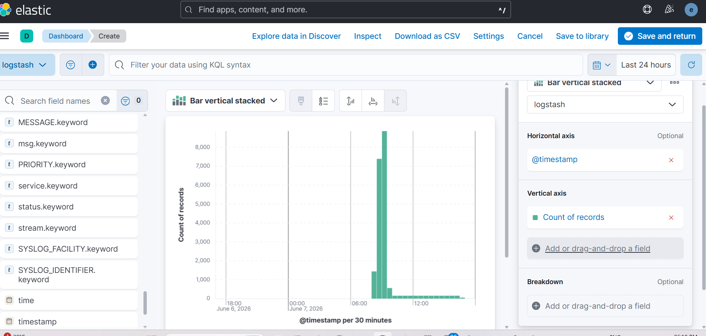

---

## Issues Faced & Fixes

See full details: [docs/troubleshooting/infrastructure-issues-and-fixes.md](docs/troubleshooting/infrastructure-issues-and-fixes.md)

### Issue 1 — EKS Node Group vCPU Limit Exceeded

Multiple failed terraform apply attempts left orphaned node groups
consuming all 16 vCPU quota. Fixed by manually deleting orphaned
node groups via AWS CLI and removing tainted resources from
Terraform state.

```bash
aws eks delete-nodegroup \
  --cluster-name devops-sr-dev-eks \
  --nodegroup-name <name> \
  --region us-east-1

terraform state rm 'module.eks...aws_eks_node_group.this[0]'
terraform state rm 'module.eks...aws_launch_template.this[0]'
terraform apply
```

### Issue 2 — Terraform State Tainted Resources

Previous failed applies left stale tainted references in remote
state causing replacement loops. Fixed by backing up state and
removing stale entries using terraform state rm.

### Issue 3 — FluentBit 401 Unauthorized to Elasticsearch

FluentBit was sending logs without credentials. Fixed by upgrading
helm release with HTTP_User and HTTP_Passwd config pointing to
Elasticsearch credentials secret.

### Issue 4 — CloudDrove VPC Module Internal Bug

CloudDrove VPC module v2.0.5 referenced non-existent
data.aws_region.current.region internally. Fixed by using
terraform-aws-modules/vpc for VPC and keeping clouddrove/subnet
for subnets only.

### Issue 5 — Windows Git Bash chmod Not Working

chmod +x on Windows had no effect before first commit. Fixed using:
```bash
git update-index --chmod=+x scripts/*.sh
```

---

## Improvements Roadmap

| Improvement | Description |
|-------------|-------------|
| ArgoCD | GitOps-based continuous delivery |
| Vault | Proper secret management |
| Multi-environment | dev, staging, prod workspaces |
| Velero | Cluster backup and disaster recovery |
| OPA Gatekeeper | Policy enforcement |
| Karpenter | Node autoscaling |
| AWS WAF | Web application firewall |
| Multi-region | Disaster recovery setup |

---


